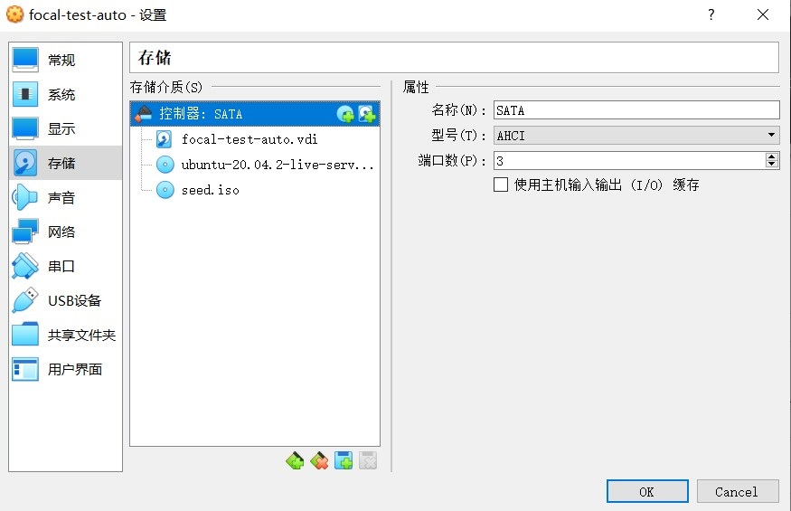
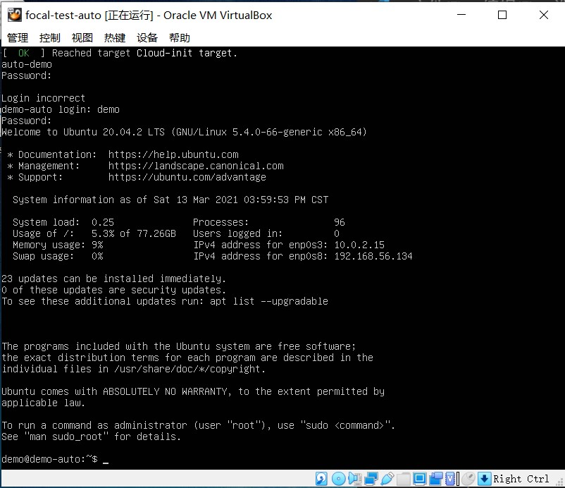
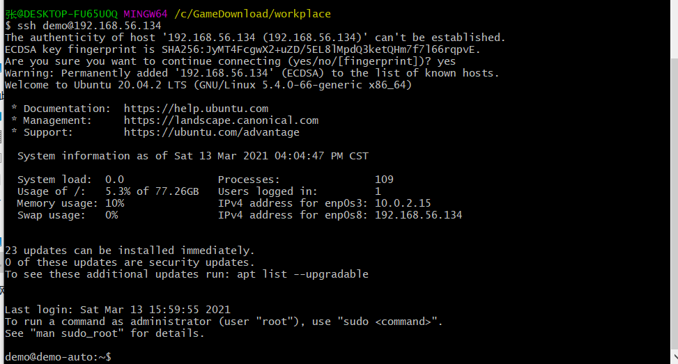

# 第一章：Linux基础-实验

实现特性：
* 制作无人值守安装iso并在Virtualbox中完成自动化安装
* 实现ssh免密登录

## 软件环境
* Virtualbox 版本 6.1.18 (with the VirtualBox Guest Additions installed)
* 虚拟机：ubantu20.04.02-live-server 64bit
* 网卡：NAT、Host-Only
* 主机：windows10,git version 2.23.0.windows.1


### 具体过程：

#### uer-data 文件制作

##### 得到初始 user-data

在手动安装一个Ubantu 后，可得到一个初始的`user-data` 文件。在`/var/log/installer/autoinstall-user-data`目录下。使用git bash用ssh连接所安装虚拟机将这个配置文件用scp命令下载下来：`scp demo@192.168.56.106:/var/log/installer/autoinstall-user-data ./`。这里下载到的当前目录。


得到一个初始`autoinstall-user-data`文件:
```yml
#cloud-config
autoinstall:
  apt:
    geoip: true
    preserve_sources_list: false
    primary:
    - arches: [amd64, i386]
      uri: http://cn.archive.ubuntu.com/ubuntu
    - arches: [default]
      uri: http://ports.ubuntu.com/ubuntu-ports
  identity: {hostname: demo, password: $6$7FV.fYyyFnxy.6yR$Iv09QUFAWsOL7idMYYe33ugGRJS/Lc8Q/A8mv.5ulDSjwJXuEzjUAcM2ulS2uG2V162WUQpjuD9n0aVzs.FL9/,
    realname: demo_my_name, username: demo}
  keyboard: {layout: us, toggle: null, variant: ''}
  locale: en_US
  network:
    ethernets:
      enp0s3: {dhcp4: true}
      enp0s8: {dhcp4: true}
    version: 2
  ssh:
    allow-pw: true
    authorized-keys: []
    install-server: true
  storage:
    config:
    - {ptable: gpt, serial: VBOX_HARDDISK_VBed651610-3e7065e9, path: /dev/sda, wipe: superblock-recursive,
      preserve: false, name: '', grub_device: true, type: disk, id: disk-sda}
    - {device: disk-sda, size: 1048576, flag: bios_grub, number: 1, preserve: false,
      grub_device: false, type: partition, id: partition-0}
    - {device: disk-sda, size: 85896200192, wipe: superblock, flag: '', number: 2,
      preserve: false, grub_device: false, type: partition, id: partition-1}
    - {fstype: ext4, volume: partition-1, preserve: false, type: format, id: format-0}
    - {device: format-0, path: /, type: mount, id: mount-0}
  version: 1

```

#### 修改 user-data
这里参考了[课件中提到的user-data](https://gist.github.com/bitsandbooks/6e73ec61a44d9e17e1c21b3b8a0a9d4c)中，与[老师提供的user-data](https://c4pr1c3.github.io/LinuxSysAdmin/exp/chap0x01/cd-rom/nocloud/user-data)。
修改如下,修改地方详见代码注释：
```yaml
#cloud-config
autoinstall:
  apt:
    geoip: true
    preserve_sources_list: false
    primary:
    - arches: [amd64, i386]
      # uri: http://cn.archive.ubuntu.com/ubuntu
      uri: http://mirrors.tuna.tsinghua.edu.cn/ubuntu # 换镜像源
    - arches: [default]
      # uri: http://ports.ubuntu.com/ubuntu-ports
      uri: https://mirrors.tuna.tsinghua.edu.cn/ubuntu-ports # 换镜像源
  network:
    ethernets:
      enp0s3: {dhcp4: true}
      enp0s8: {dhcp4: true}
    version: 2
  ssh:
    allow-pw: true
    authorized-keys: []
    install-server: true
  storage: # 改了分区方式
    config:
    - {ptable: gpt, path: /dev/sda, wipe: superblock,
      preserve: false, name: '', grub_device: true, type: disk, id: disk-sda}
    - {device: disk-sda, size: 1MB, flag: bios_grub, number: 1, preserve: false,
      grub_device: false, type: partition, id: partition-0}
    - {device: disk-sda, size: 1GB, wipe: superblock, flag: '', number: 2,
      preserve: false, grub_device: false, type: partition, id: partition-1}
    - {fstype: ext4, volume: partition-1, preserve: false, type: format, id: format-0}
    - {device: disk-sda, size: -1, wipe: superblock, flag: '', number: 3,
      preserve: false, grub_device: false, type: partition, id: partition-2}
    - name: ubuntu-vg
      devices: [partition-2]
      preserve: false
      type: lvm_volgroup
      id: lvm_volgroup-0
    - {name: ubuntu-lv, volgroup: lvm_volgroup-0, size: -1, preserve: false,
      type: lvm_partition, id: lvm_partition-0}
    - {fstype: ext4, volume: lvm_partition-0, preserve: false, type: format, id: format-1}
    - {device: format-1, path: /, type: mount, id: mount-1}
    - {device: format-0, path: /boot, type: mount, id: mount-0}
  version: 1
  user-data: # cloud-config data goes under this heading 
    #cloud-config
    timezone: Asia/Shanghai # 时区设置
    locale: en_US.UTF-8 
    hostname: demo-auto
    groups:  
      - coven
    users: # 添加用户
      - name: demo
        gecos: "demo"
        primary_group: coven
        groups: sudo
        lock-passwd: false
        passwd: $6$7FV.fYyyFnxy.6yR$Iv09QUFAWsOL7idMYYe33ugGRJS/Lc8Q/A8mv.5ulDSjwJXuEzjUAcM2ulS2uG2V162WUQpjuD9n0aVzs.FL9/ #  password hash
        shell: /bin/bash
        ssh_authorized_keys:
          - ssh-rsa AAAAB3NzaC1yc2EAAAADAQABAAABgQDhsIAOMlUq55DcVj5eMdQ7DcIafagbJOT7AiqQiSBKLC/uqw9bkDEhOzQAVtbD3WPMJXzppBP/WX+CZYoHCjEilfogcFX11OLyr97Uy3XqU/Wu54MXB+dyq+sdvKc5B0Oxr8KKB+hBlnNov/bDMwYs7ibxKFWnHikCfxhjvOVe/7cgAA72HzOj/+i8tuk3BLVouqlIp713D0WBIwoALw8i6tItunRYky6+SR8gcAkPv8pwQPte3l459M8oMCI7R6e49RcsY49duIWOy1XNKJkSvn99BgxH7OuXzCeFgyzPX6mgcNZpLMSklWRfuDrRJaoaInCdcIqDtFm3/Fqz3Oih4KoSpiMPsmxGT46p5/ZRQEjv8BAPDfda3lGi9nCwsBSsmgue0XNHU6vS8KVHnjVSeYSTjzdFsM0sbuX0txpyDet1jmtz/bR1uGOSRtw+bmjxbHqGQiyc+7BRSk/5utiW/XRwPiTXG6sFxdrdGVx9I8dWkBLwCITtHd3pBksdL4M= 19331907@qq.com # 添加ssh 公钥 进行免密登录
        sudo: "ALL=(ALL) NOPASSWD:ALL"
        uid: 9000

```

#### 创建一个meta-data 文件
在本地上创建一个空的`meta-data`文件

#### 将两个文件上传到连接上的linux 虚拟机制作镜像

* 在git bash 中输入以下命令进行文件上传：
`scp autoinstall-user-data meta-data demo@192.168.56.106:/home/demo/workplace`

注：这里autoinstall-user-data 是上述修改过后的user-data；这里所上传到的路径是linux中`/home/demo/workplace`路径。


* 输入：`sudo apt install cloud-image-utils`。先在linux上安装`cloud-image-utils`。
  
* 用以下命令检查文件格式是否正确：`cloud-init devel schema -c autoinstall-user-data`。如果输出：`Valid cloud-config: autoinstall-user-data`说明文件格式没有问题，冒号后面是你的文件名。


* 接着使用命令`cloud-localds ./seed.iso autoinstall-user-data  meta-data`制作名为seed.iso 的镜像。这里制作的结果放在当前目录下。

* 然后在本地git bash 上使用命令`scp demo@192.168.56.106:/home/demo/workplace/seed.iso ./`将远程做好的镜像拷贝出来。（在linux上可使用pwd 查看当前目录位置）


#### 准备工作完毕 ，挂载镜像
* 创建一个虚拟机，配置网络为NAT网络，与Host only。移除所创建虚拟机的「设置」-「存储」-「控制器：IDE」
* 在「控制器：SATA」下新建 2 个虚拟光盘，按顺序 先挂载「纯净版 Ubuntu 安装镜像文件」后挂载 seed.iso

挂载好后，你的虚拟机应该是这样子的：


总览：

注意顺序

#### 启动
这里安装过程一共用时：7min29s,gif 预览效果缩短至9s，具体用时与你的网络环境有关。

（中间窗口录屏的时候被部分挡到，但总体上并不影响预览）


* 最终输入你设置的组的用户名和密码进行登录


#### 远程免密登录测试：
在新安装好的linux中输入`ip a`查看ip地址。之后在git bash 中输入`ssh demo@192.168.56.134`，@前面是你的用户名，后面是你要登录的地址，在虚拟机中使用`ip a`查看改机的地址。

测试结果：


结果：可见demo用户免密成功登入

## 第一次实验过程中遇到的问题

* 因为windows 上用户名是中文，而用windows 命令行的时候会发生编码错误，提示不能创建`'C:\\Users\\\345\274\240/.ssh'`。也就是ssh信任目录。
使用git bash ，再改一下git bash 的编码为utf-8即可。


* 自动安装中间一直在某步花大量时间。过了很久，然后输出一对:
`start:subiquity/Network/_send_update:CHANGE enp0s8
finish:subiquity/Network/_send_update:CHANGE enp0s8`。
参考了下玄学方法，测试发现其实是网络问题，只需要在`user-data`文件中改一下镜像源改成国内的就行了。

* 测试制作的镜像死活不能进行无人值守安装。
用`cloud-init -h` 命令时，发现自己把`user-data`与`meta-data`的命令输入文件顺序弄反了:broken_heart:。
* 在启动后，发现安装过程中又卡在某步
检查了下，`user-data` 文件中编码拼写写错了。

## 参考资料

[课件以及参考视频](https://c4pr1c3.github.io/cuc-wiki/linux/2021/index.html)

[吕九洋师哥的实验报告](https://github.com/CUCCS/linux-2020-LyuLumos/blob/ch0x01/ch0x01/%E7%AC%AC%E4%B8%80%E6%AC%A1%E5%AE%9E%E9%AA%8C%E6%8A%A5%E5%91%8A.md#%E7%BD%91%E7%BB%9C%E9%85%8D%E7%BD%AE)

[cloud-init-documentation](https://cloudinit.readthedocs.io/en/latest/topics/faq.html?highlight=debug#how-can-i-debug-my-user-data)

[Autoinstall Quick Start](https://ubuntu.com/server/docs/install/autoinstall-quickstart)

[Ubuntu 20.04 + Autoinstall + VirtualBox](https://gist.github.com/bitsandbooks/6e73ec61a44d9e17e1c21b3b8a0a9d4c)

[downloading file using scp command](https://superuser.com/questions/374531/downloading-file-using-scp-command)

[SCP copy windows local file to linux remote folder](https://serverfault.com/questions/582048/scp-copy-windows-local-file-to-linux-remote-folder)
