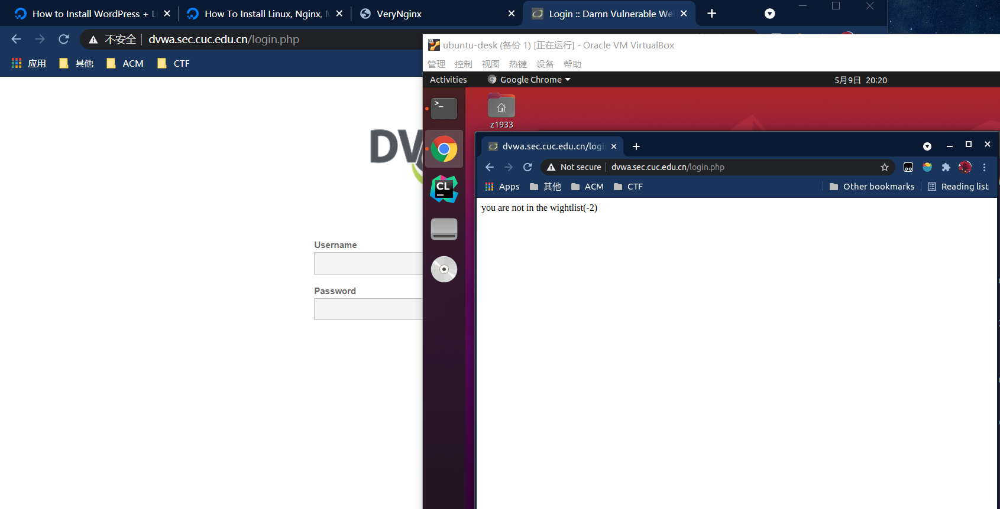
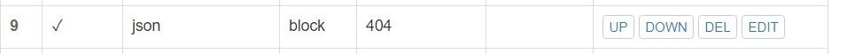
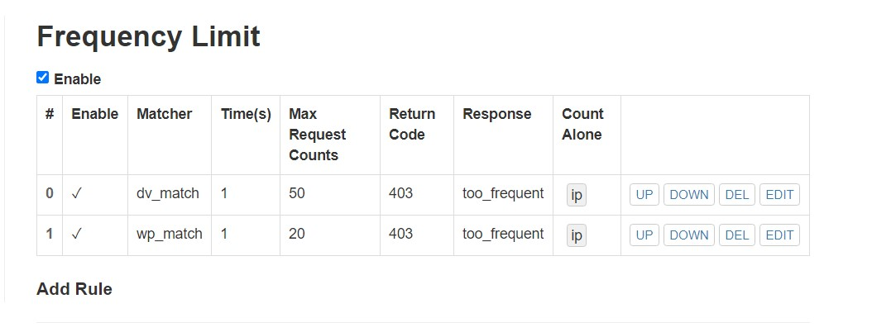
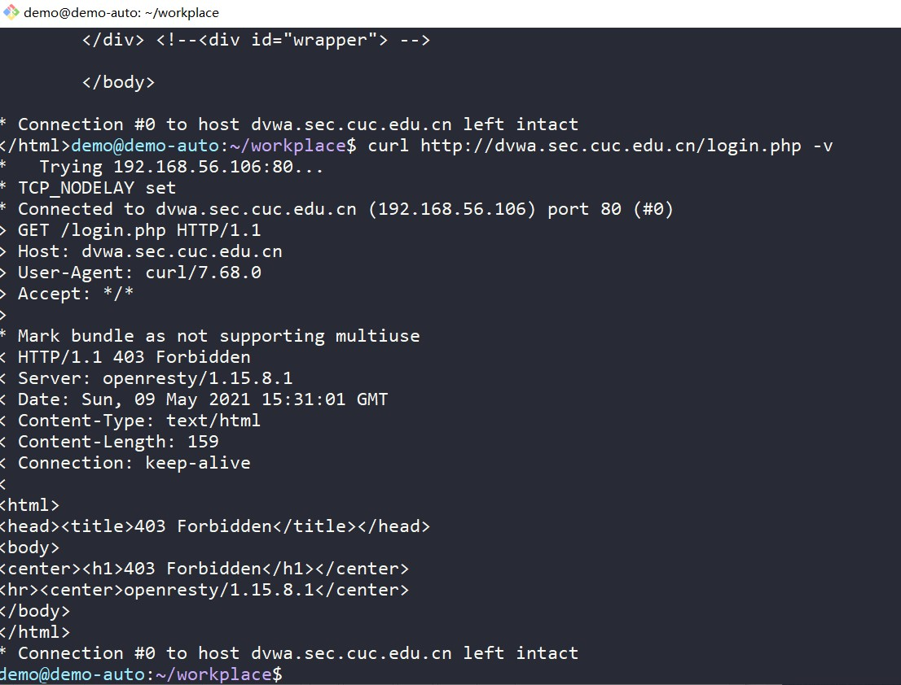

# 第五章：Web服务器（实验）
## 实验环境
* 主机: Ubuntu 20.04 LTS
* 客机:windows10,Ubuntu 20.04.2 LTS

## 安装配置步骤
### 更改客机上的Hosts文件
```
192.168.56.106 vn.sec.cuc.edu.cn  
192.168.56.106 dvwa.sec.cuc.edu.cn
192.168.56.106 wp.sec.cuc.edu.cn
```
### Nginx安装&配置
```bash
# 安装
sudo apt update
sudo apt -y install nginx
# Nginx默认为80端口，这里将Nginx的监听端口改为8080
sudo sed -i 's/80/8080/' /etc/nginx/sites-available/default
sudo systemtcl reload nginx
```
然后客机就可以访问`192.168.56.106:8080`了。
### VeryNginx 安装
```bash
# 安装依赖
sudo apt -y install gcc make python3 libssl-dev libssl1.1 libpcre3-dev unzip zlib1g-dev 
git clone https://github.com/alexazhou/VeryNginx.git
sudo python3 install.py install # 如果安装失败根据报错安装依赖即可
sudo adduser nginx 
# 修改权限
chmod -R 777 /opt/verynginx/verynginx/configs
# 启动
sudo /opt/verynginx/openresty/nginx/sbin/nginx
```
* 然后就可以访问`vn.sec.cuc.edu.cn/verynginx/index.html`了。


### wordpress 安装
按照[How to Install WordPress with LEMP on Ubuntu 20.04
](https://www.digitalocean.com/community/tutorials/how-to-install-linux-nginx-mysql-php-lemp-stack-on-ubuntu-20-04#step-4-%E2%80%94-configuring-nginx-to-use-the-php-processor)所给的步骤
```bash
sudo apt -y install mysql-server php-fpm php-mysql
# 安装扩展
sudo apt install php-curl php-gd php-intl php-mbstring php-soap php-xml php-xmlrpc php-zip
# 建立根目录
sudo mkdir /var/www/wp.sec.cuc.edu.cn
sudo chown -R www-data:www-data  /var/www/wp.sec.cuc.edu.cn
# 写入配置文件
sudo tee /etc/nginx/sites-available/wp.sec.cuc.edu.cn << EOF
server {
    listen 8081;
    server_name wp.sec.cuc.edu.cn.sec.cuc.edu.cn www.wp.sec.cuc.edu.cn.sec.cuc.edu.cn;
    root /var/www/wp.sec.cuc.edu.cn.sec.cuc.edu.cn;

    index index.html index.htm index.php;

    location / {
        #try_files $uri $uri/ =404;
       try_files $uri $uri/ /index.php$is_args$args;
    }

    location = /favicon.ico { log_not_found off; access_log off; }
    location = /robots.txt { log_not_found off; access_log off; allow all; }
    location ~* \.(css|gif|ico|jpeg|jpg|js|png)$ {
        expires max;
        log_not_found off;
    }

    location ~ \.php$ {
        include snippets/fastcgi-php.conf;
        fastcgi_pass unix:/var/run/php/php7.4-fpm.sock;
     }

    location ~ /\.ht {
        deny all;
    }

}
EOF
# 创建软链接
sudo ln -s /etc/nginx/sites-available/wp.sec.cuc.edu.cn /etc/nginx/sites-enabled/ 
sudo unlink /etc/nginx/sites-enabled/default
# check
sudo nginx -t
# 下载安装包
sudo wget https://wordpress.org/wordpress-4.7.zip
unzip wordpress-4.7.zip
cp wordpress/wp-config-sample.php wordpress/wp-config.php
# 修改配置文件，写入数据库信息
sed -i 's/database_name_here/wp_db/' wp-config.php
sed -i 's/username_here/wordpress/' wp-config.php
sed -i 's/password_here/wordpress/' wp-config.php
# 追加
sed -i  "$ a define( 'FS_METHOD', 'direct' );" wordpress/wp-config.php
# 增加一行，禁止wordpress自动更新
sed -i "$ a define( 'WP_AUTO_UPDATE_CORE', false );" wordpress/wp-config.php
# 将其移动到目录下
sudo cp -a /tmp/wordpress/. /var/www/wp.sec.cuc.edu.cn 
sudo chown -R www-data:www-data /var/www/wp.sec.cuc.edu.cn 
# 创建wordpress 数据库
sudo mysql
CREATE DATABASE wp_db;
CREATE USER 'wordpress'@'localhost' IDENTIFIED BY 'wordpress';
GRANT ALL ON wp_db.* TO 'wordpress'@'localhost';
exit
# check
sudo nginx -t
sudo systemctl restart php7.4-fpm
```
然后客机访问`192.168.56.106:8081`

一个简单的Zhang1933博客网就搭建好了

###  DVWA 搭建
与Wordpress步骤类似
```bash
git clone https://github.com/ethicalhack3r/DVWA
cp DVWA/config/config.inc.php.dist DVWA/config/config.inc.php 
sudo cp -a DVWA/. /var/www/dvwa.sec.cuc.edu.cn
sudo chown www-data:www-data  /var/www/dvwa.sec.cuc.edu.cn
# 写入配置文件
sudo tee /etc/nginx/sites-available/dvwa.sec.cuc.edu.cn <<EOF
server {
    listen 8082;
    server_name dvwa.sec.cuc.edu.cn www.dvwa.sec.cuc.edu.cn;
    root /var/www/dvwa.sec.cuc.edu.cn;

    index index.html index.htm index.php;

    location / {
        #try_files $uri $uri/ =404;
       try_files $uri $uri/ /index.php$is_args$args;
    }

    location = /favicon.ico { log_not_found off; access_log off; }
    location = /robots.txt { log_not_found off; access_log off; allow all; }
    location ~* \.(css|gif|ico|jpeg|jpg|js|png)$ {
        expires max;
        log_not_found off;
    }

    location ~ \.php$ {
        include snippets/fastcgi-php.conf;
        fastcgi_pass unix:/var/run/php/php7.4-fpm.sock;
     }

    location ~ /\.ht {
        deny all;
    }

}
EOF
# 创建数据库
sudo mysql
CREATE DATABASE dvwa DEFAULT CHARACTER SET utf8 COLLATE utf8_unicode_ci;
CREATE USER 'dvwa'@'localhost' IDENTIFIED BY 'p@ssw0rd';
GRANT ALL ON dvwa.* TO 'dvwa'@'localhost';
exit
# 创建软链接
sudo ln -s /etc/nginx/sites-available/dvwa.sec.cuc.edu.cn /etc/nginx/sites-enabled/
# 检查
sudo nginx -t
sudo systemctl reload nginx
```
然后客机就可以通过`192.168.56.106:8082`访问dvwa了

默认用户名`admin`,密码`password`

## 实验基本要求
###  使用VeryNginx反向代理Wordpress,DVWA
注意：添加过滤规则的时候逻辑上注意顺序问题
* 添加Matcher


* 在Backend 中的Proxy Pass 中添加Up Stream

* 然后Proxy Pass 添加


然后就可以用`dvwa.sec.cuc.edu.cn`,`wp.sec.cuc.edu.cn`访问了，访问的是80端口。


### 使用IP地址方式均无法访问上述任意站点，并向访客展示自定义的友好错误提示信息页面-1
* 添加Matcher

* 添加Response

* 添加Filter ，Filter里填入添加的Response
  

  **ip访问结果：**
  
### Damn Vulnerable Web Application (DVWA)只允许白名单上的访客来源IP，其他来源的IP访问均向访客展示自定义的友好错误提示信息页面-2
* 同样添加Matcher

* Response

* Filter

测试结果:

左边ip是在白名单上的，右边ip不在

### 在不升级Wordpress版本的情况下，通过定制VeryNginx的访问控制策略规则，热修复WordPress < 4.7.1 &ensp;&ensp;Username Enumeration
在修复之前，访问`wp.sec.cuc.edu.cn/wp-json/wp/v2/users/`可以拿到一个用户信息的json。


* 添加matcher

* Filter

再次访问：

### 通过配置VeryNginx的Filter规则实现对Damn Vulnerable Web Application (DVWA)的SQL注入实验在低安全等级条件下进行防护
登录搭建的DVWA，之后选择`DVWA Security`中的`Security Level`为Low。
VeryNginx 默认过滤了`select ... from ...`形式的sql注入
但仍然可以可以通过注入得到一些信息。
比如得到正在使用的数据库名:`1' union select 1,database() # `。

* 添加Matcher

* Filter

再次输入`1' union select 1,database() #` 结果:

### VeryNginx的Web管理页面仅允许白名单上的访客来源IP，其他来源的IP访问均向访客展示自定义的友好错误提示信息页面-3
跟DVWA 的白名单类似
* Matcher 

* Filter


### 通过定制VeryNginx的访问控制策略规则实现：
#### 限制DVWA站点的单IP访问速率为每秒请求数 < 50,限制Wordpress站点的单IP访问速率为每秒请求数 < 20,超过访问频率限制的请求直接返回自定义错误提示信息页面-4。
* 编写Response

* Frequency Limit

在白名单中的客户机上编写测压脚本
```bash
#!/usr/bin/env bash
ab -n $1 -c 30 $2
curl $2
```
在修改hosts之后，输入`bash press.h 60 http://dvwa.sec.cuc.edu.cn/`
终端输出：
```bash
s is ApacheBench, Version 2.3 <$Revision: 1843412 $>
Copyright 1996 Adam Twiss, Zeus Technology Ltd, http://www.zeustech.net/
Licensed to The Apache Software Foundation, http://www.apache.org/

Benchmarking dvwa.sec.cuc.edu.cn (be patient).....done


Server Software:        openresty/1.15.8.1
Server Hostname:        dvwa.sec.cuc.edu.cn
Server Port:            80

Document Path:          /
Document Length:        0 bytes

Concurrency Level:      30
Time taken for tests:   0.143 seconds
Complete requests:      60
Failed requests:        10
   (Connect: 0, Receive: 0, Length: 10, Exceptions: 0)
Non-2xx responses:      60
Total transferred:      24020 bytes
HTML transferred:       170 bytes
Requests per second:    420.34 [#/sec] (mean)
Time per request:       71.372 [ms] (mean)
Time per request:       2.379 [ms] (mean, across all concurrent requests)
Transfer rate:          164.33 [Kbytes/sec] received

Connection Times (ms)
              min  mean[+/-sd] median   max
Connect:        2   21   6.2     23      33
Processing:    17   35  12.5     33      53
Waiting:        4   22   7.9     20      34
Total:         32   55  12.9     56      75

Percentage of the requests served within a certain time (ms)
  50%     56
  66%     62
  75%     65
  80%     69
  90%     73
  95%     75
  98%     75
  99%     75
 100%     75 (longest request)
(-4)Slower plz!!
```
可以看到最后的提示信息以及总次数为60，失败10次
### 禁止curl访问
* Matcher

* Filter

curl访问结果：

# 参考链接
* [VeryNginx Wiki](https://github.com/alexazhou/VeryNginx/wiki/%E7%9B%AE%E5%BD%95)
* [Permanently removing apache2](https://askubuntu.com/questions/176964/permanently-removing-apache2)
* [Why You Need To Check Your Current WordPress Version](https://www.hostinger.com/tutorials/how-to-check-which-version-of-wordpress-you-are-using#Method_1_-_Checking_WordPress_Version_in_the_Admin_Area)
* [大白话之从零讲解 DVWA(壹)-SQL 注入 (SQL Injection) Low Level](https://ld246.com/article/1553218743009)
* [How to Install WordPress with LEMP on Ubuntu 20.04](https://www.digitalocean.com/community/tutorials/how-to-install-wordpress-with-lemp-on-ubuntu-20-04)
* [HTTP 响应代码](https://developer.mozilla.org/zh-CN/docs/Web/HTTP/Status)
* [How to Disable Automatic Updates in WordPress](https://www.wpbeginner.com/wp-tutorials/how-to-disable-automatic-updates-in-wordpress/)
* [What does upstream mean in nginx?](https://stackoverflow.com/questions/5877929/what-does-upstream-mean-in-nginx)
* [linux-2020-LyuLumos](https://github.com/CUCCS/linux-2020-LyuLumos/blob/ch0x05/ch0x05/%E7%AC%AC%E4%BA%94%E6%AC%A1%E5%AE%9E%E9%AA%8C%E6%8A%A5%E5%91%8A.md#%E5%AE%9E%E9%AA%8C%E8%A6%81%E6%B1%82)
* [linux-2019-DcmTruman](https://github.com/CUCCS/linux-2019-DcmTruman/blob/0x05/0x05/%E5%AE%9E%E9%AA%8C%E6%8A%A5%E5%91%8A.md#%E9%85%8D%E7%BD%AEverynginx%E8%AE%BF%E9%97%AEwpseccuceducn)

